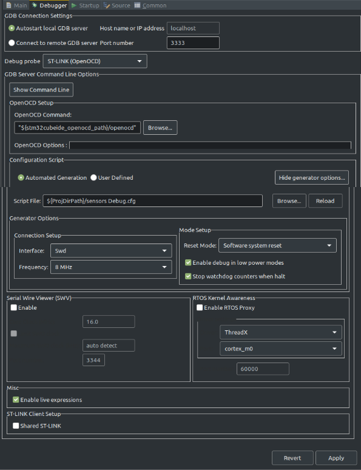

# stm32-blue-demo

Using the STM32 Blue Pill to get up to speed on the STM32 environment. Note: The chip is the SMT32F103C8. (A lot of generic blue pill boards will use a functionally idential chip as this)

## Project Notes: 

More branches will be added for project development, but the main branch will always have the latest stable working version of all the projects. The README will include images and links to more resources where necessary. If somethign doesn't work or is difficult to understand, please submit an issue. 

Sections include: 

- [Connecting and Programming](#connecting-and-programming)

    - [Applications You'll Need](#applications)

    - [Pin Configurations](#pin-setup)

    - [Build Configuration](#build-configuration)
    - [Code Notes](#code-notes)

- [Debugging](#debugging)

    - [Serial Output](#serial-output)

    - [Briking a board](#what-happens-when-i-brick-the-board?)

- [Folders in Repository](#folders)

#
# Connecting and Programming

## Applications

This uses the ST-Link V2 programmer. Lots of generic ones available. Be sure to properly connect the SWDIO and SWDCLK lines. 

Applications you'll need: 

 - STM32CubeProgrammer -> used for connecing to the baord and reading data

 - STM32CubeIDE -> used to configure the chip, develop firmware, upload to board, debugging and more

## Pin Setup

**Important** when configuring the pins, Enable the SYS Debug mode as "Serial Wire". If you don't, after uploading (if you can) you may brick the board (See [Debugging](#debugging))

## Build Configuration

Under the Debug Configuration options, add a new debug configuration for each project you create. In "Debugger", "Debug probe" should be "ST-LINK (OpenOCD)". 

Select "Show Generator Options" for more options. Under "Mode Setup" select "Software System Reset"

## Code Notes

For GPIO I/O use:
    
    HAL_GPIO_WritePin(GPIOA, GPIO_PIN_1, GPIO_PIN_SET)

**GPIOA** refers to the A or B pins, use GPIOA or GPIOB

**GPIO_PIN_1** refers to the pin number, use the number you want to switch

**GPIO_PIN_SET** is the state of the gpio. **_SET** changes the state and **_RESET** turns it back to the default

Delay function: 

    HAL_DELAY(1000)

Where **1000** is the time in system ticks. This corresponds to the number of system ticks which is not always 1ms, so be careful. 

#
# Debugging

## Serial Output

## What Happens when I brick the board? 

First off, "brick" means that the board is no longer accepting programming information. The most common reason is the chip is no longer looking for input. (the programming pins disabled after upload) The way to fix this is (first) to ensure the SYS -> Debug mode is set to "Serial Wire" in the "Pinout & Configuration options before uploading to the board. Next we have to erase the board and re-upload the program.

## Erasing the Chip

You'll need to use the "STM32CubeProgrammer" Application to connect to the board and erase the chip. This process can be tricky. You'll have to hold the reset on the board before you press "connect" but release it about 1-2 seconds after pressing "connect". Timming is crutial and may take a couple tries. 
#
# Folders

## Blink Folder

Quick Demonstration for the STM32CubeIDE environment to make the STM32 Blue Pill Blink. (Default is 2000ms interval). 
You should be able to open this project and upload to the blue pill. 

## Sensor Reading Folder

This is a more in depth overview about connecing an analog sensor (potentiometer) and reading the values on the computer. 

